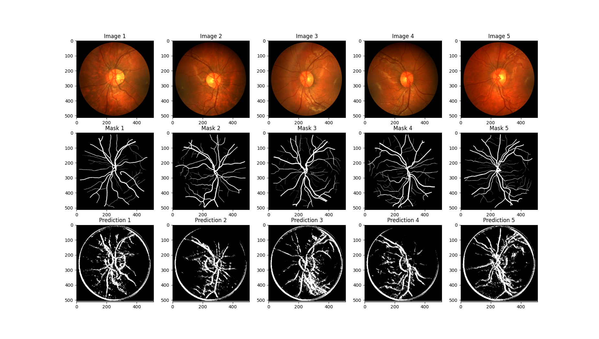
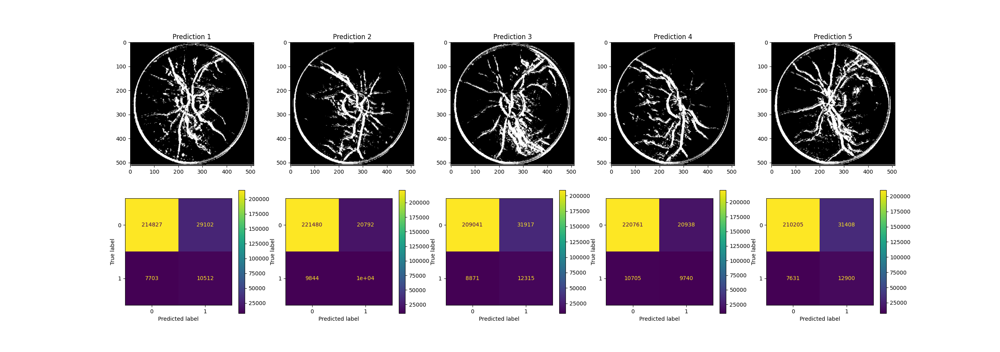

## Sieć neuronowa

### Język programowania oraz biblioteki
Język programowania: Python 3.10.4

Biblioteki:
* matplotlib
* cv2
* tabulate
* numpy
* sklearn
* tensorflow
* keras
* segmentation_models

Na początku wczytujemy dane niezbędne do trenowania modelu. Składają się na nie dwadzieścia dwa obrazy oraz odpowiadające im maski eksperckie.

Zbiór jest dzielony na zbiór treningowy i walidacyjny.

Model, który został wykorzystany, to sieć U-net z biblioteki segmentation_models. Jest on zdefiniowany używając architektury VGG16 jako podstawy. Model przyjmuje obrazy o kształcie (512, 512, 3) i ma na wyjściu jedną klasę. Aktywacja sigmoidalna jest stosowana na ostatniej warstwie modelu.

Model jest kompilowany z optymalizatorem Adam, który ma współczynnik nauki ustawiony na 1e-4. Jako funkcję straty używana jest bce_jaccard_loss z biblioteki segmentation_models, która łączy stratę binary cross-entropy (bce) z indeksem Jaccarda. Jako metrykę oceny modelu używana jest iou_score, również z biblioteki segmentation_models.

Przed treningiem zbiór treningowy jest dzielony na trzy sekcje za pomocą funkcji KFold, aby przeprowadzić walidację krzyżową. Obrane przez nas parametry przy treningu to wielkość batcha 10, 2 epoki. W trakcie treningu zapisywany jest najlepszy model.

Wyniki są zadawalające, ale mogłyby być lepsze. Można by spróbować zwiększyć liczbę epok, ale wtedy istnieje ryzyko przeuczenia modelu. Można by też spróbować zwiększyć wielkość zbioru treningowego poprzez augumentację. Niestety znacząco wydłużyłoby to czas trenowania modelu.

| Image    |   Accuracy |   Sensitivity |   Specificity |
|:---------|-----------:|--------------:|--------------:|
| Image 1  |       0.86 |          0.58 |          0.27 |
| Image 2  |       0.88 |          0.5  |          0.33 |
| Image 3  |       0.84 |          0.58 |          0.28 |
| Image 4  |       0.88 |          0.48 |          0.32 |
| Image 5  |       0.85 |          0.63 |          0.29 |
| Mean     |       0.86 |          0.55 |          0.3  |

Sieć U-net dawała lepsze wyniki dla obrazów o większej rozdzielczości. Aby jednak zachować spójność z poprzednimi etapami (przetwarzanie obrazu, uczenie maszynowe) zddcydowaliśmy się na wykorzystanie obrazów o mniejszych rozdzielczościach.