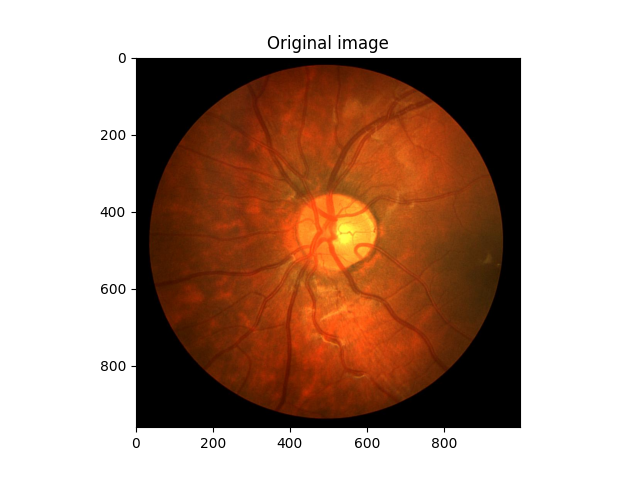
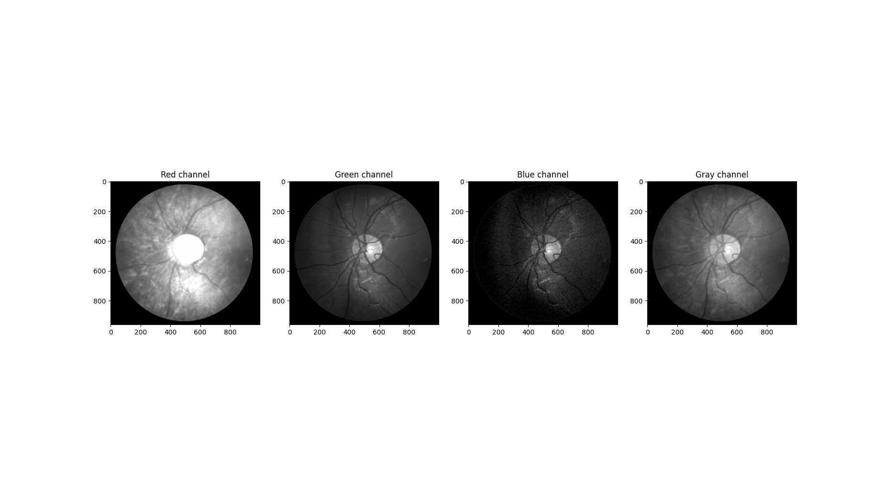
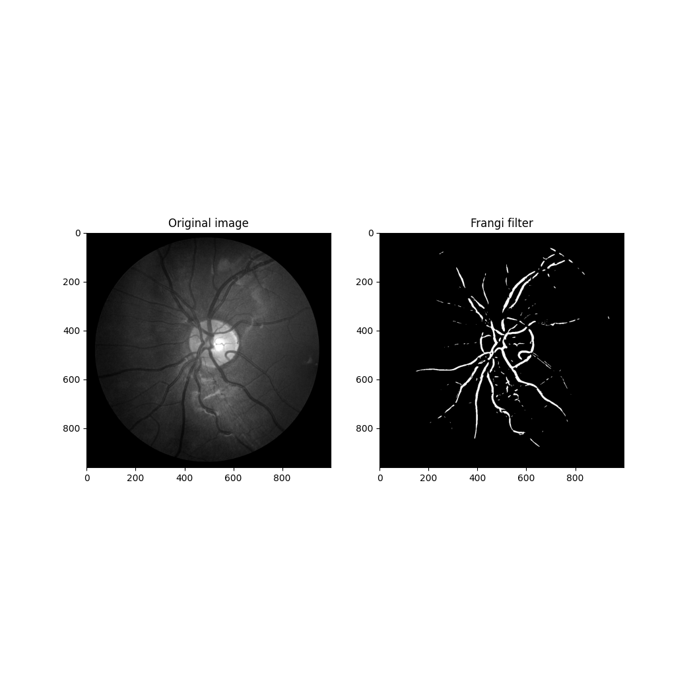
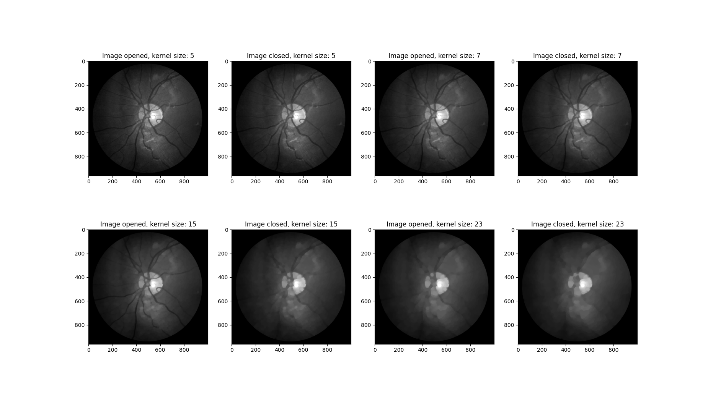
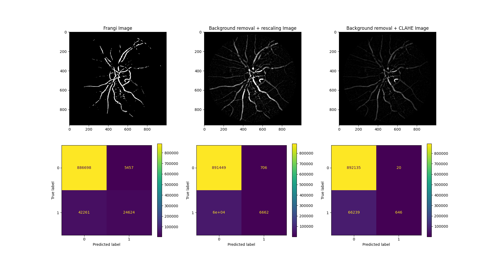

## Przetwarzanie obrazów

Na początku dokładnie przeanalizowaliśmy obraz, biorąc pod uwagę składowe różnych kolorów oraz reprezentację w odcieniach szarości. Zauważyliśmy, że najwięcej przydatnych informacji do detekcji naczyń krwionośnych znajduje się w składowej koloru zielonego. W związku z tym, w kolejnych etapach przetwarzania, postanowiliśmy opierać się na tej składowej.

Pierwszą zastosowaną techniką była metoda wyrównania histogramu CLAHE (Contrast Limited Adaptive Histogram Equalization), która ma na celu poprawę kontrastu obrazu. Dzięki temu uzyskujemy obraz z lepszym wyróżnieniem naczyń krwionośnych. Następnie poddaliśmy przetworzony obraz filtracji za pomocą filtra Frangi, który jest skuteczny w wykrywaniu krawędzi. W konsekwencji, uzyskujemy obraz z zaznaczonymi fragmentami naczyń krwionośnych.

W tej metodzie warto rozważyć zastosowanie rozmycia Gaussa przed przetwarzaniem obrazu lub dostosowanie jasności, aby naczynia krwionośne na obrazie wynikowym były wyraźniej widoczne. Dodatkowo, można eksperymentować ze zmianą parametrów filtru Frangi, aby osiągnąć lepsze rezultaty.

Kolejną zastosowaną techniką jest przetwarzanie obrazu poprzez sekwencyjne operacje morfologiczne otwarcia i zamknięcia z różnymi rozmiarami jądra (kernela). W wyniku tego procesu uzyskujemy obraz, który eliminuje drobne szumy i artefakty, jednocześnie zachowując większe struktury. Odejmując tak przetworzony obraz od oryginalnego, otrzymujemy obraz z wyraźnie zaznaczonymi naczyniami krwionośnymi.

Aby uczynić naczynia jeszcze bardziej widocznymi, zdecydowaliśmy się zastosować rozmycie Gaussa w celu usunięcia szumów z obrazu oryginalnego. Następnie przeprowadzamy reskalowanie intensywności, ograniczając wartości powyżej 20, aby uzyskać lepszy kontrast. Dodatkowo, dla celów porównawczych, stosujemy również metodę wyrównania histogramu CLAHE, aby ocenić różnice w rezultatach.

Aby ocenić skuteczność poszczególnych metod ręcznego przetwarzania obrazu, przygotowaliśmy macierz błędów oraz miary jakościowe. Poniżej przedstawiamy wyniki w formie tabeli. Dla celów porównania obrazów, przyjmujemy, że (w skali od 0 do 1), piksele o wartości powyżej 0,75 otrzymują wartość 1, natomiast piksele o wartościach poniżej tej granicy są traktowane jako 0. Jest to binarna maska odpowiedzi algorytmu.

| Method                         |   Accuracy |   Sensitivity |   Specificity |
|:-------------------------------|-----------:|--------------:|--------------:|
| Frangi                         |       0.93 |          0    |          1    |
| Background removal + rescaling |       0.94 |          0.1  |          0.9  |
| Background removal + CLAHE     |       0.93 |          0.01 |          0.97 |