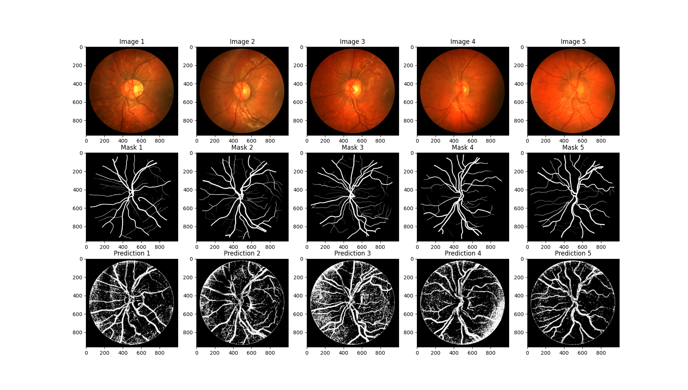
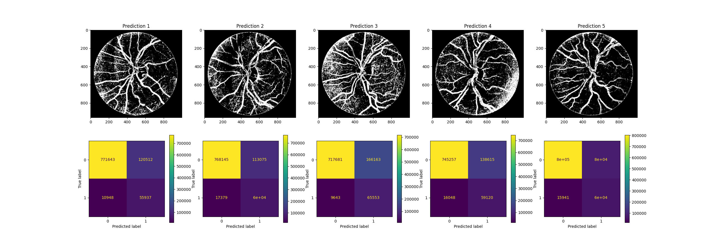

## Uczenie maszynowe

### Język programowania oraz biblioteki
Język programowania: Python 3.9

Biblioteki:
* matplotlib
* cv2
* tabulate
* numpy
* sklearn
* imblearn
* sklearnex

Na początku wczytujemy dane niezbędne do trenowania modelu. Składają się na nie pięć obrazów, z których ekstrahujemy cechy, oraz odpowiadające im maski eksperckie.

Obszar dna oka, który nas interesuje, znajduje się w centrum obrazu. Fragmenty poza polem widzenia nie dostarczają nam żadnych istotnych informacji. Z tego względu stworzyliśmy funkcję, która przetwarza obraz jedynie w obrębie okręgu wpisanego w obraz. Proces przetwarzania odbywa się ramka po ramce, z oknem przesuwanym o 1 piksel.

Funkcja ekstrakcji cech analizuje obszar o rozmiarze 5x5, obliczając jego wariancję, średnią oraz momenty Hu. W ten sposób uzyskujemy 9 cech dla każdego piksela. Analogicznie analizowana jest maska ekspercka - do macierzy etykiet zapisywane są wartości 0 lub 1, w zależności od tego, czy piksel jest identyfikowany jako tło czy naczynie.

Wynikiem działania funkcji są macierze cech i etykiet. Są one sporej wielkości, ale można zauważyć, że większość cech jest związana z etykietą 0. Aby zrównoważyć liczność klas, wykonujemy RandomUnderSampling, który usuwa nadmiarowe próbki z klasy 0. Następnie dodatkowo zmniejszamy liczność zbioru, aby przyspieszyć uczenie modelu. Można tutaj pozostawić większą liczbę próbek, co może skutkować wzrostem dokładności.

W celu zbudowania i dostrajania definiujemy model RandomForestClassifier() oraz tworzymy potok przetwarzania (pipeline) składający się z jednego kroku, którego zadaniem jest wykorzystanie klasyfikatora. Potok pozwala na ustrukturyzowanie procesu uczenia i ewentualne dodanie kolejnych etapów przetwarzania. Wyniki wychodzą podobne przy zastosowaniu scalera StandardScaler(), dlatego zdecydowaliśmy się na pominięcie tego kroku.

Następnie definiujemy siatkę parametrów, które mają zostać przetestowane podczas dostrajania modelu. Parametry te obejmują liczbę drzew w lesie (n_estimators), maksymalną głębokość drzew (max_depth), minimalną liczbę próbek wymaganą do podziału węzła (min_samples_split) oraz minimalną liczbę próbek wymaganą na liściu (min_samples_leaf).

Aby przeprowadzić proces dostrajania modelu, tworzymy obiekt GridSearchCV, który będzie przeszukiwać siatkę parametrów w celu znalezienia najlepszego zestawu dla modelu. Parametr n_jobs=-1 pozwala na wykorzystanie wszystkich dostępnych rdzeni procesora, przyspieszając tym samym proces dostrajania.

Ostatecznie, dopasowujemy model do danych treningowych za pomocą metody fit(), która pozwala na przeprowadzenie uczenia modelu na podstawie wybranych cech i etykiet.

Najlepsze parametry wybrane przez GridSearchCV dla klasyfikatora lasów losowych to:

* max_depth: None (brak ograniczenia na głębokość drzew),
min_samples_leaf: 1 (minimalna liczba próbek wymagana na liściu),
* min_samples_split: 5 (minimalna liczba próbek wymagana do podziału węzła),
* n_estimators: 100 (liczba drzew w lesie).
  
Najlepszy uzyskany wynik dla tych parametrów, mierzony jako średnia dokładność walidacji krzyżowej (cross-validation score), wynosi 0.8049 (około 80,49%).

Dokładność modelu na zbiorze treningowym wynosi 0.9924 (99,24%), co oznacza, że model bardzo dobrze dopasowuje się do danych treningowych. Natomiast dokładność modelu na zbiorze testowym wynosi 0.8079 (80,80%), co sugeruje, że model jest w stanie przewidywać klasyfikację naczyń krwionośnych na nowych danych z satysfakcjonującą precyzją.

| Method   |   Accuracy |   Sensitivity |   Specificity |
|:---------|-----------:|--------------:|--------------:|
| Image 1  |       0.86 |          0.84 |          0.32 |
| Image 2  |       0.86 |          0.78 |          0.35 |
| Image 3  |       0.82 |          0.87 |          0.28 |
| Image 4  |       0.84 |          0.79 |          0.3  |
| Image 5  |       0.9  |          0.79 |          0.43 |
| Mean     |       0.86 |          0.81 |          0.34 |

Analizując uzyskane wyniki, można stwierdzić, że istnieje potencjał do dalszej poprawy. Jednym z czynników, który mógłby wpłynąć na lepsze rezultaty, jest zwiększenie liczby próbek tła. Chociaż RandomUnderSampler pozwala na zrównoważenie klas, jego parametry ograniczają się do zakresu 0-1, co może wpłynąć na ogólną jakość modelu. Najwięcej szumu na obrazie wynikowym jest spowodowane właśnie potraktowaniem ciemnego tła jako naczyń krwionośnych.

Dodatkowo, model mógłby zapewne osiągnąć lepszą wydajność, gdyby był trenowany na większej liczbie próbek. Obecna konfiguracja została dostosowana do szybkich obliczeń, co może ograniczać możliwości modelu.
Innym aspektem, który warto rozważyć, jest jakość obrazów oraz ich rozdzielczość. Zastosowanie bardziej szczegółowych obrazów z innego zbioru danych lub zmiana rozmiaru okna analizy może pomóc w redukcji szumów i poprawie jakości segmentacji.
Na podstawie naszych obserwacji, wstępne przetwarzanie danych za pomocą rozmycia Gaussa wydaje się przynosić pewne korzyści, choć niewielkie. Dalsze eksperymenty z technikami przetwarzania wstępnego mogą pozwolić na uzyskanie lepszych wyników.